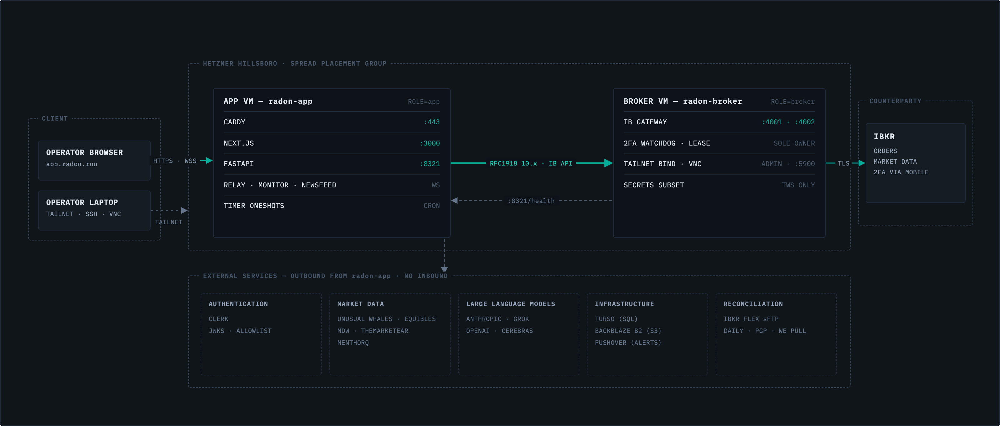

# SPOF host split — operator runbook



The picture is illustrative, rendered at 39bf6f5e from a source outside
the repo. Not shown: the app → broker `10.0.0.4:8340` mTLS Gateway-control
edge (`radon-ib-gateway-remote.service`). Authoritative edges are
`cloud/services/*`, `cloud/caddy/Caddyfile`, the Hetzner firewall, and
Phase 1 below. Do not hand-edit the PNG.

Code in this SHA is combined-host safe. `RADON_HOST_ROLE` defaults to
`combined`. Merging does not create a second VM, move Gateway, or enable
Hetzner backups. Those steps are below and cannot be done by CI.

Do not merge the sudoers-grant commit until you can bootstrap in the same
window. Preflight refuses `scripts/*` / `config/*` mismatches until
`refresh-control-plane-privileged` is installed.

## What this SHA deploys on the current VPS

- Tailscale 4001 bind is `${IB_GATEWAY_TAILSCALE_BIND:-100.112.32.16}`.
- `hhlev` / `hyad` / `vixts` join `auto-sync-units.txt`.
- `refresh-control-plane-privileged` is in sudoers (needs one bootstrap).
- Relay and monitor are no longer `PartOf=` Gateway. A Gateway 2FA restart
  no longer cascade-stops the app plane.
- `RADON_HOST_ROLE` unset means `combined` (this box owns Gateway). Set
  `app` only at the Phase 1 cut: the app role refuses every local Gateway
  mutation including 2FA recovery (`services.py`,
  `ib-gateway-control.sh refuse_app_role_mutation`, `Ib2faControls.tsx`
  `ownsGatewayLifecycle`) and proxies Force 2FA / Stop / Start to the
  broker over mTLS instead. Without the `RADON_IB_REMOTE_*` client vars
  the admin Gateway controls go read-only with no error.

`llm-index` (drift-allowlisted, not installed) and `mktnews`
(manifest-pinned, installed) stay off auto-sync. Control-plane timers (`db-backup`, `refresh`, `portfolio-sync`,
`drift-audit`, …) stay off auto-sync.

## Phase 0 — this week, on the box you have

1. Confirm backups. Repo has no record.

   ```bash
   hcloud server describe <current-server> -o json | jq '.public_net, .backup_window, .datacenter'
   ```

   If `backup_window` is empty: enable Hetzner automated backups (20% of
   server price, 7 daily slots). They do not survive server deletion.

2. Named snapshot at a known-green SHA, after a green deploy:

   ```bash
   hcloud server create-image --type snapshot --description "radon-green-<sha>" <server>
   ```

   Ashburn snapshots stay in Ashburn. Not off-site.

3. Copy `/etc/radon/env` to B2 under a tight prefix. Do not put it in git.

4. Restore drill, under 20 minutes, off RTH:

   - Snapshot.
   - Power off the live server (or create a *new* server from the snapshot
     and keep the original off).
   - Boot replacement.
   - One IBKR Mobile tap.
   - `curl -sS http://127.0.0.1:8321/health` → `auth_state=authenticated`.
   - Old VM stays off. Two Gateways, same username, one dies.

5. Optional: set `IB_GATEWAY_TAILSCALE_BIND` in `/etc/radon/env` if the
   tailnet IP is no longer `100.112.32.16`. Then `radon-ib-gateway-control
   restart` (2FA).

## Phase 0B — one root bootstrap (this SHA)

The commit that adds `refresh-control-plane-privileged` cannot auto-apply
that sudoers line. After merge, before the next CI deploy:

```bash
TARGET_SHA=<exact-tested-sha>
sudo -u radon -H git -C /home/radon/radon fetch --prune origin
TARGET_COMMIT="$(sudo -u radon -H git -C /home/radon/radon rev-parse "${TARGET_SHA}^{commit}")"
CURRENT_COMMIT="$(sudo -u radon -H git -C /home/radon/radon rev-parse HEAD)"
if [ "$CURRENT_COMMIT" != "$TARGET_COMMIT" ]; then
  sudo -u radon -H git -C /home/radon/radon merge --ff-only "$TARGET_COMMIT"
fi
test "$(sudo -u radon -H git -C /home/radon/radon rev-parse HEAD)" = "$TARGET_COMMIT"
cd /home/radon/radon
bash cloud/scripts/bootstrap-control-plane.sh
```

Do not restart Gateway. Re-run CI for the same SHA if the in-flight deploy
refused preflight. After this, helper/sudoers/polkit edits deploy without
root SSH.

## Phase 1 — second VM (not this deploy)

Create, in the same Ashburn DC, spread placement group, Hetzner Cloud
Network `radon-private` `10.0.0.0/16` (app `10.0.0.2`, broker `10.0.0.4`).
Small CX. Tailscale + private net. FastAPI trusts `10.0.0.0/16` only for
the broker watchdog's `GET /health` probe (`is_private_net_probe`,
`scripts/api/auth.py`); it is not in the global server-to-server bypass, so
a private-net peer still needs a Clerk JWT or API key for orders, admin and
exec. Not all RFC1918: `172.16.0.0/12` is `docker0` territory and stays
untrusted. `check-env.py` accepts any private v4 for
`IB_GATEWAY_HOST`, so a non-`10.0/16` network deploys green and then every
private-net probe is silently unauthenticated.

Broker VM:

- `RADON_HOST_ROLE=broker`
- `IB_GATEWAY_HOST=127.0.0.1`
- `IB_GATEWAY_TAILSCALE_BIND=<new 100.x>`
- Add a compose private-net bind for `10.x:4001` (not in this SHA; add
  when the 10.x exists).
- Own control-plane bootstrap. Gateway + helper + lease + watchdog only.
- Watchdog `HEALTH_URL=http://10.0.0.2:8321/health`. `/health` is
  trust-scoped: only a `10.0.0.0/16`, tailnet, or loopback peer without
  forwarding headers gets `auth_state`. A probe via `app.radon.run` reads
  `{"status":"ok"}` and the watchdog goes blind.
- Secrets subset: TWS user/pass, VNC, session policy. Not `UW_TOKEN`.

App VM (current box):

- `RADON_HOST_ROLE=app`
- `IB_GATEWAY_HOST=10.0.0.4` (private net, not `100.x`, not public)
- Uninstall Gateway units **and** `/usr/local/bin/radon-ib-gateway-control`.
  FastAPI treats helper-exists as ownership. Leave it and boot starts a
  second Gateway.
- Cut complete: `systemctl is-enabled radon-ib-gateway` is not-found;
  `docker ps` has no `ib-gateway`.
- `check-env.py` refuses a public, CGNAT, or DNS `IB_GATEWAY_HOST` on the
  app role. It does not check that the address is inside `10.0.0.0/16`.

Move window is off RTH plus one Mobile tap on the broker. App deploy must
leave `auth_state=authenticated` on 4001.

Operator commands after the cut:

- App: `ssh root@ib-gateway radon {start|stop|restart|status}`
  App-plane only. Does not cycle Gateway.
- Broker: `ssh root@<broker> radon {start|stop|restart|status}`
  Gateway via `radon-ib-gateway-control`. Does not require radon-health.
- App admin Force 2FA / Stop / Start Gateway proxies over mTLS to
  `https://10.0.0.4:8340` (`scripts/ib_gateway_remote/serve.py`). Setup:
  1. Broker: `cloud/scripts/ib-gateway-remote-certs.sh` writes the CA,
     server, and client pairs under `/etc/radon/ib-remote`. Copy `ca.pem`,
     `client.pem`, `client-key.pem` to the app host at the same paths.
  2. App `/etc/radon/env`: set `RADON_IB_REMOTE_URL`, `RADON_IB_REMOTE_CA`,
     `RADON_IB_REMOTE_CLIENT_CERT`, `RADON_IB_REMOTE_CLIENT_KEY` (block in
     `cloud/.env.example`). Then `radon restart` on the app: the API
     container mounts `/etc/radon/ib-remote` read-only only if the
     directory exists when the unit starts (`radon-app-runtime.sh`).
  Rotation (REL-178/R-496): the pair is 825-day self-signed. Re-run the
  mint script on the broker before expiry and re-copy the three files to the
  app host, then restart `radon-ib-gateway-remote` (broker) and `radon-api`
  (app). Expiry is surfaced as `ib_remote_cert_days_left` on the broker
  `/healthz`, `ib_gateway.remote.cert_days_left` on the app `/health`, and
  the ib-watchdog health row warns under 30 days / pages under 7.
  3. Broker: `systemctl enable --now radon-ib-gateway-remote.service`.
     `RADON_IB_REMOTE_ALLOW` is host addresses only (`10.0.0.2`); the
     daemon refuses to start on a subnet. `RADON_IB_REMOTE_CLIENT_NAMES` is
     the second half of the perimeter — the client-certificate CN / DNS SAN
     allowlist, default `radon-app`, matching the `DNS:radon-app` SAN the
     mint script writes. An empty value is a `ConfigError` at startup, not a
     silent open door; set it only if you mint a client cert under a
     different name. Bind is `10.0.0.4`, never `0.0.0.0`. Hetzner firewall:
     8340 and 4001 from `10.0.0.2` only.
  Verify from the app host, no Gateway side effect:
  `curl --cacert /etc/radon/ib-remote/ca.pem --cert /etc/radon/ib-remote/client.pem --key /etc/radon/ib-remote/client-key.pem https://10.0.0.4:8340/healthz`
  → `{"ok":true,"service":"ib-gateway-remote"}`.
  Certificates expire 825 days after minting (`-days 825` in the script).
  The proxy's status ladder (`scripts/api/services.py`,
  `scripts/ib_gateway_remote/serve.py`) discriminates the failure:
  `504` (`REMOTE_UNREACHABLE_RC`) the daemon was not reachable at all —
  down, firewalled, or wrong `RADON_IB_REMOTE_URL`; `502`
  (`REMOTE_BAD_REPLY_RC`) it answered but not with a usable reply, which is
  where an expired or untrusted certificate lands; `403` the peer address is
  not in `RADON_IB_REMOTE_ALLOW` (`source not allowlisted`) or the client
  certificate's CN/DNS SAN is not in `RADON_IB_REMOTE_CLIENT_NAMES`
  (`client certificate not allowlisted`); `409` the request was refused, not
  failed — a held 2FA lease or the 60s per-verb cooldown, with the reason in
  `detail`. Expiry also shows the Gateway row as `load_state=remote`,
  `active_state=unknown`. For 502/403, re-run the mint script and steps 1-3;
  Gateway itself is untouched. A 409 needs no action but time.
  Reversal: `systemctl disable --now radon-ib-gateway-remote.service` on
  the broker and unset `RADON_IB_REMOTE_URL` on the app (controls go
  read-only, no error).
- App `Restart All Services` stays app-plane. It does not cycle Gateway.

Do not put the broker in Falkenstein. Do not run two Gateways. Do not
restore a broker snapshot beside a live broker. Do not start a standby
FastAPI pool against a live Gateway.

## Never

- Kubernetes / Compose-as-OS / hot second IBKR username as HA.
- Tailscale as the production order path.
- `hcloud server rebuild` of broker while the original is still logged in.

## Done when

App deploy does not 2FA. App VM kill does not kill the IB session. Broker
restore is exclusive. Unit-only and privileged helper edits need no
standing root session.
